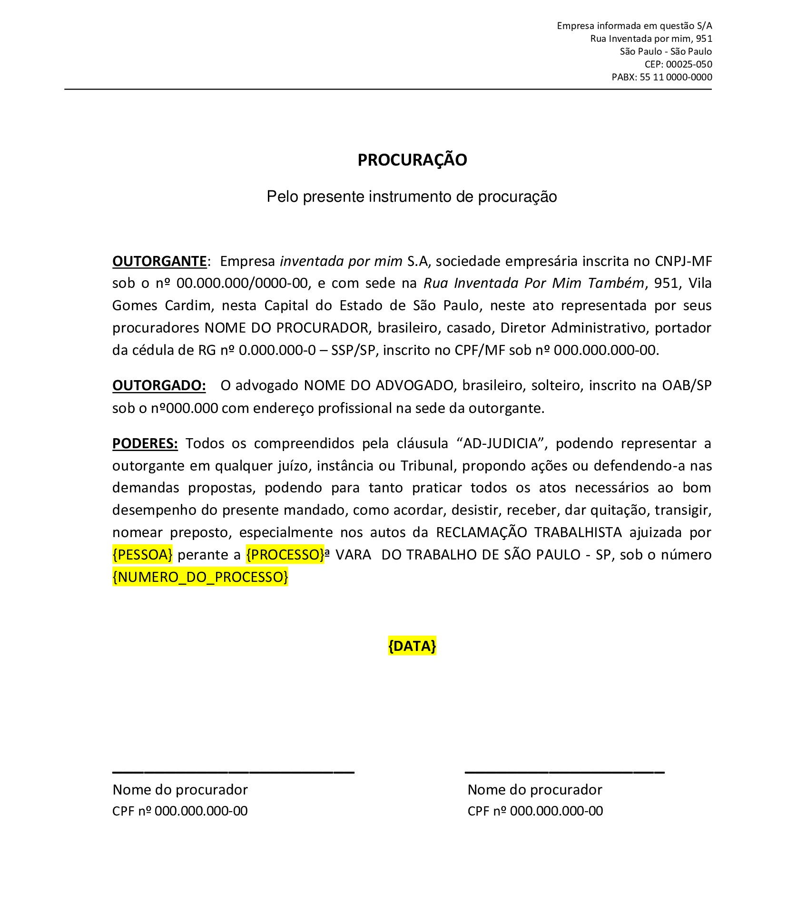

## Automatizando criação de documentos Word com Python

Este código Python oferece uma solução eficiente para automatizar a substituição de marcadores em um documento Word por valores provenientes de um banco de dados. 

É especialmente útil quando você precisa gerar múltiplos documentos com informações variáveis sem precisar copiar e colar manualmente.

## Funcionamento
O código se conecta a um banco de dados *MySQL* e recupera os dados de uma tabela específica. 
Em seguida, ele carrega um modelo de **documento** ***microsoft word*** que contém marcadores específicos, indicados entre chaves **{}**, como: "{PROCESSO}", "{PESSOA}", "{NUMERO_DO_PROCESSO}", "{DATA}". 
O código então usa os dados recuperados do banco de dados e substitui esses marcadores pelos valores correspondentes. 
Finalmente, ele salva cada documento modificado com um nome único, não apagando o documento originale e gerando novos documentos até acabar a quantidade especificada no banco de dados.

## Requisitos
1. Python 3.x
2. Biblioteca mysql-connector para conexão ao banco de dados MySQL
3. Biblioteca python-docx para manipulação de documentos Word

## Instruções de Uso
Instale as dependências necessárias executando: `pip install mysql-connector-python python-docx.`

Certifique-se de ter um banco de dados *MySQL\MariaDB* configurado e acessível. Caso tenha dúvidas de como criar a tabela, há um arquivo de refência neste repositório chamado `mala.sql`.

Configure as credenciais de acesso ao banco de dados *(host, user, password, database)* na seção apropriada do código.

Prepare um documento *microsoft word* contendo os marcadores que deseja substituir pelos dados do banco de dados.

Por fim, no mesmo diretório em que estiver o documento word e arquivo `mudar_os_nomes.py`, abra um terminal e digite: `python3 mudar_os_nomes.py`

## Exemplo de uso utilizado neste código
Suponha que você tenha uma carta de procuração onde precisa preencher vários processos trabalhistas, alterando o seguinte: `Nome` da pessoa no processo, `número do processo`, número da vara trabalhista no `processo` e a `data` final do documento.

Neste caso, é possível criar um banco de dados chamado "projetos" com uma tabela chamada "mala", contendo as colunas: "Pessoa", "Processo", "Numero" e "Data". 

Após isso, Você pode usar este código para gerar documentos Word para cada entrada na tabela "mala", substituindo os marcadores no modelo de documento pelos valores correspondentes.

## Observações
Certifique-se de que o modelo de documento Word contém os mesmos marcadores especificados no código para garantir substituições precisas.
Os documentos gerados serão salvos no mesmo diretório onde o script Python está sendo executado.

## Imagem animada do software funcionando
